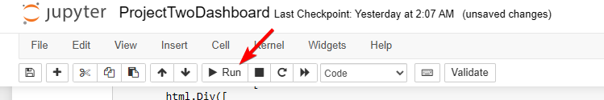
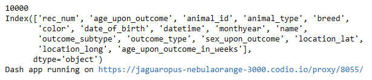
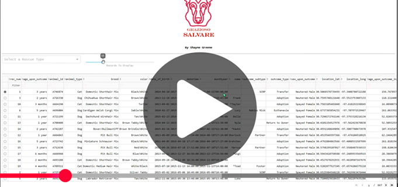

<a id="readme-top"></a>
<!-- TABLE OF CONTENTS -->
<details>
  <summary>Table of Contents</summary>
  <ol>
    <li>
      <a href="#about-the-project">About The Project</a>
      <ul>
        <li><a href="#built-with">Built With</a></li>
        <li><a href="#Motivation">Motivation</a></li>
      </ul>
    </li>
    <li>
      <a href="#getting-started">Getting Started</a>
      <ul>
        <li><a href="#prerequisites">Prerequisites</a></li>
      </ul>
    </li>
    <li><a href="#usage">Usage</a></li>
    <li><a href="#Demo">Demo</a></li>
    <li><a href="#Contact">Contact</a></li>
  </ol>
</details>

# About the Animal Shelter Project


This application will allow users to identify dog candidates for search-and-rescue training.\
Users will be able to filter their selection based on the rescue type they are looking for. \
This program will allow you to connect to your specified MongoDB and retrieve the data as needed.\
The AnimalShelter class baked in the animal_shelter_crud library gives you all the features needed to retrieve your data. 

## Built With

* [](https://www.python.org/downloads/)
* [](https://jupyter.org/)
* [](https://www.mongodb.com/)


### Motivation
The application was developed with the user in mind. We wanted to make access to potential dog training candidates
easily accessed on one place.\
We hope that this application makes sorting and filtering an intuitive and enjoyable process.  

## Getting Started

### Prerequisites

#### A connection to MongoDB
Where all your animal information will be stored.\
The database can either be local (for testing) or through a network.

#### Latest version of Python installed. [Python](https://www.python.org/downloads/)
Python is the core language for this application. 

#### An IDE (Integrated Development Environment) to edit and run the code. (optional but recommended)
You will need to run this application in a Jupyter Notebook.
Any IDE that runs Python will work: **PyCharm**, **Visual Studio Code** (Both will run on Mac or Windows OS)
You can create and run a Jupyter Notebook from either of the IDE's listed above.

[](https://www.jetbrains.com/pycharm/)\
[](https://code.visualstudio.com/download)

### Python Codebase (included)
* ProjectTwoDashboard.ipynb
* animal_shelter_crud.py (Library for the AnimalShelter class and CRUD)
<p align="right">(<a href="#readme-top">back to top</a>)</p>

## Usage

Import both Python files into a new Project\
Open **ProjectTwoDashboard.ipynb** in a new Juypter Notebook.\
CHange **ProjectTwoDashboard.ipynb** with your MongoDB credentials
```python
username = "your_username"
password = "your_password"
host = "localhost"
port = 27017
database = "your_database" 
collection = "your_collection"
```
<br>
You can uncomment these lines to test your connection to the database:

```python
## Debug
print(len(df.to_dict(orient='records')))
print(df.columns)
```
### Jupyter Notebook...

1. In your Jupyter Notebook, with the code block selected, click "Run"
>

2. Sample output with debug code active. When you have an active connection you will get the collection records count and 
columns in that collection.
>

3. Click on the link after "Dash app running on ". This will open a browser and run the application.
   * ***NOTE:*** If the link will not open, try using a different Browser. I found issues trying to run on Brave. Works well with Chrome

<p align="right">(<a href="#readme-top">back to top</a>)</p>

### Update Filtering Options
You can update the filtering parameters easily within the ***ProjectTwoDashboard.ipynb*** code.\
Example updating the *"Water"* Rescue Type
```python
def update_dashboard(filter_type):
    if filter_type == 'Water':
        query = {
            "$and": [
                # You can update the gender of the dog  
                {"sex_upon_outcome": "Intact Female"},
                {
                    "$or": [
                        # You can add or remove breeds  
                        {"breed": "Labrador Retriever Mix"},
                        {"breed": "Chesapeake Bay Retriever"},
                        {"breed": "Newfoundland"}
                    ]
                },
                {
                    # You can update the age filter $gte = min  $lte = max  in weeks
                    "age_upon_outcome_in_weeks": {
                        "$gte": 26,
                        "$lte": 156
                    }
                }
            ]
        }
```


# Demo

---
[](https://youtu.be/RYHoaf2M4GA)\


## Contact

---
Shayne Greene - Email - shayne.greene@snhu.edu

Project Link: [https://github.com/DecoyChild/CS-340](https://github.com/DecoyChild/CS-340)


